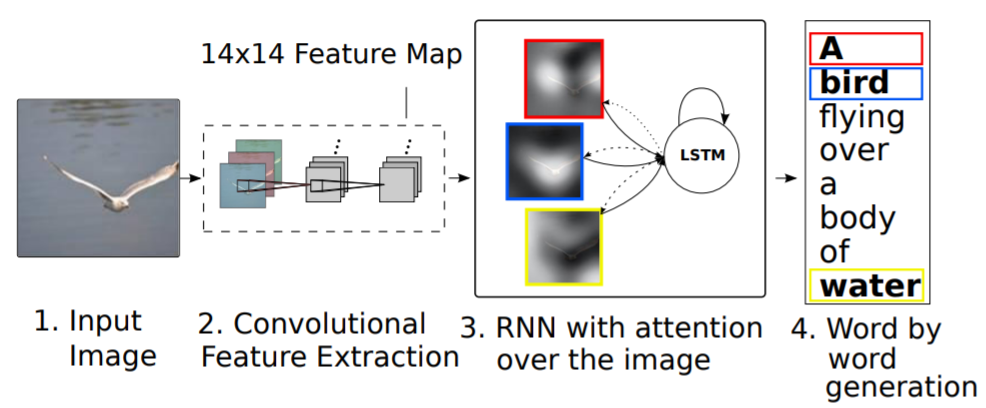
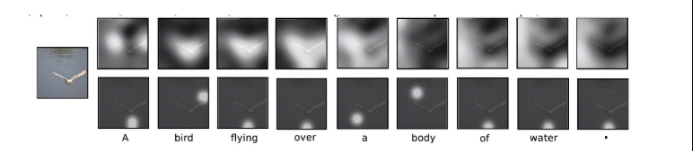
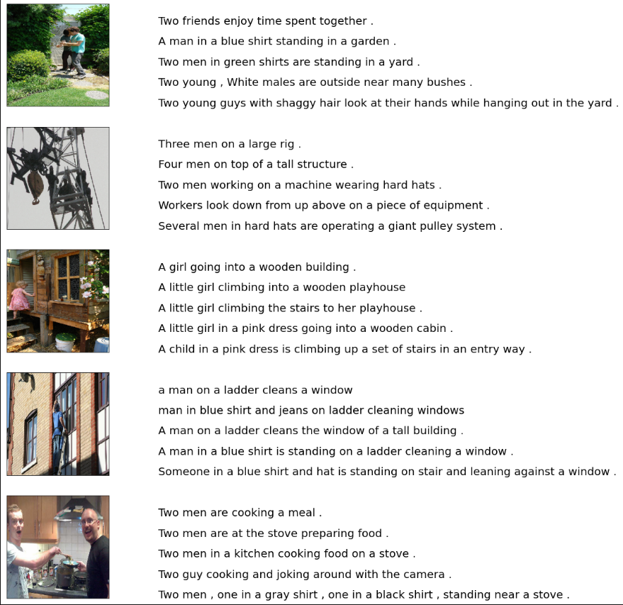
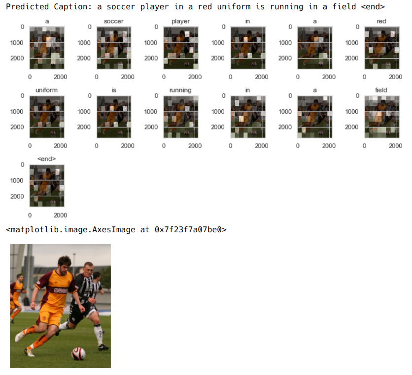
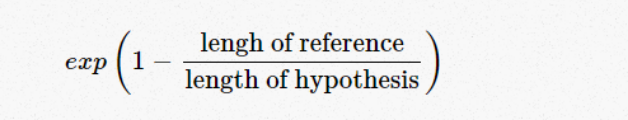

# Neural Image Captioning

## Problem Statement
Automatically describing the content of an image is a fundamental problem in artificial intelligence that connects computer vision and natural language processing. Implement a clean working code and extract results using Tensorflow2/Keras/PyTorch for the research paper [Show, Attend and Tell: Neural Image Caption Generation with Visual Attention](https://arxiv.org/pdf/1502.03044.pdf).

## What is image captioning?
To build networks capable of perceiving contextual subtleties in images, to relate observations to both the scene and the real world, and to output succinct and accurate image descriptions.

## Methodology to Solve the Task
The task of image captioning can be logically divided into two modules:
1. Encoder - Image based model:
    - Task: To extract features from the image and generate vectors of those features.
    - Input: Source Image from Dataset.
    - Output: Flattened vectors of image features for Language Model.
    - Model/Technique Used: Transfer Learning on Inception-ResNet-V2.
2. Decoder - Language based model:
    - Task: Translates the features and objects given by the image based model to a caption i.e. a natural sentence.
    - Input: Flattened vectors of image features.
    - Output: Caption for image.
    - Model/Technique Used: Bi-Directional Long Short-Term Memory (LSTM) with bahdanau attention.
    - Embeddings: GloVe Embeddings - 6B.300d

The images below summarizes the approach given above:

## Dependencies
1. Anaconda3 or Miniconda3.
2. Python 3.9 (should work with 3.6+ ideally)
3. Libraries from mentioned in [requirements.txt](requirements.txt).
4. Dataset: [Flickr30k dataset](https://www.kaggle.com/hsankesara/flickr-image-dataset).
5. Word Embeddings: [GloVe(6B or 42B or 840B)](https://nlp.stanford.edu/projects/glove/).

## Project Structure
    ├── data
    │   ├── flickr30k_images                <- Flickr30k Dataset.
    │   └── captions.csv                    <- Captions for the Flickr30k Dataset. Downloaded by default.
    │
    ├── notebooks
    │   ├── glove.xB.xxxd.txt               <- GloVe Embeddings.
    │   └── neural_image_captioning.ipynb   <- Main Notebook to run.
    │
    └── models
        └── checkpoint                      <- Save the model checkpoints.

## How to run the project?
1. Install all the dependencies and place them in the structure.
2. Run the [neural_image_captioning.ipynb](./notebooks/neural_image_captioning.ipynb) file in a `jupyter-notebooks` or `jupyter-lab` session.
3. Use the model checkpoints in the [models/checkpoint](./models/checkpoint) folder to export the model.

## Sample Input
There are a total of 31,783 images and 158,915 captions.
Hence a total of 5 captions per image.

## Sample Output
The sample output consists of three parts:
1. Predicted caption.
2. Attention in image.
3. Original image.

## Performance Indicatior
*BELU* is used as the key performance indicator.
BELU is a well-acknowledged metric to measure the similarly of one hypothesis sentence to multiple reference sentences.

The primary task for a BELU implementor is to compare n-grams of the candidate with the n-grams of the reference and count the number of matches. These matches are position-independent.

Given a single hypothesis sentence and multiple reference sentences, it returns value between 0 and 1. The metric close to 1 means that the two are very similar.

The more the matches, the better the candidate is.

## Future Improvements
The model currently doesn't show a great BLEU score but as shown above captures the gist of the image.
It has only been trained for 4 epochs owing to the large dataset i.e. Flickr30k, using the Inception-ResNet-v2 model, a deep BiDirectionalLSTM and the lack of powerful computational power. Hence, one training epoch takes ~10,000 seconds == ~3 hours.

The predictions can be made more accurate by:
- Adding more Bidirectional LSTM layers.
- Train the model for a more epochs eg. 50 epochs(as mentioned in the paper).
- Use state-of-the-art NLP techniques such as transformers(BERT).
- Use the larger MSCOCO dataset or data augmentation.

## References
1. Papers:
    - [Show, Attend and Tell: Neural Image Caption Generation with Visual Attention](https://arxiv.org/pdf/1502.03044.pdf)
    - [Learning Phrase Representations using RNN Encoder–Decoder for Statistical Machine Translation](https://arxiv.org/pdf/1406.1078.pdf)
    - [Long-term Recurrent Convolutional Networks for Visual Recognition and Description](https://arxiv.org/pdf/1411.4389.pdf)
    - [Deep Visual-Semantic Alignments for Generating Image Descriptions](http://proceedings.mlr.press/v37/xuc15.pdf)

2. Implementations:
    - [DeepRNN/image_captioning](https://github.com/DeepRNN/image_captioning)
    - [Tensorflow Tutorial](https://www.tensorflow.org/tutorials/text/image_captioning#caching_the_features_extracted_from_inceptionv3)

3. Videos:
    - [Neural Image Caption Generation with Visual Attention (algorithm) | AISC](https://www.youtube.com/watch?v=ENVGHs3yw7k)
    - [Building an Image Captioner with Neural Networks](https://www.youtube.com/watch?v=c_bVBYxX5EU)
